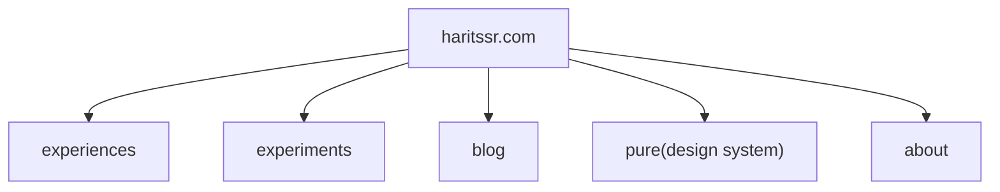

### About This Repo

This repo is Harits Syah's personal site. Includes _Experiences_, _Experiments_, _Design System_, and _Blog_.
- Experiences: All of my projects with use cases and details.
- Experiments: Experiments across TypeScript-React ecosystem stack and collection of common user interfaces on mobile and desktop web.
- Blog: Selected notes that I want to share to the world.
- Pure (Design System): User interface component library, design principles, and guidelines.

### Site Structure

### About Author

- Name : Harits Syah
- Roles : Web Product Engineer, Web Designer, and Math-Physics Teacher.
- At : [Haris Lab](https://www.harislab.com)
- Location : [South Tangerang, Indonesia](https://www.google.com/maps/place/Kota+Tangerang+Selatan,+Banten/data=!4m2!3m1!1s0x2e69fab10419c095:0x1c880c046d198c94?sa=X&ved=2ahUKEwiCnd3VqvqAAxXzcmwGHTlLDx8Q8gF6BAgYEAA&ved=2ahUKEwiCnd3VqvqAAxXzcmwGHTlLDx8Q8gF6BAgZEAI)
- Email : [haritssr@gmail.com](mailto:haritssr@gmail.com)
- Social Media : [twitter.com/haritssr](x.com/haritssr)
- Site : [haritssr.com](https://www.haritssr.com)
