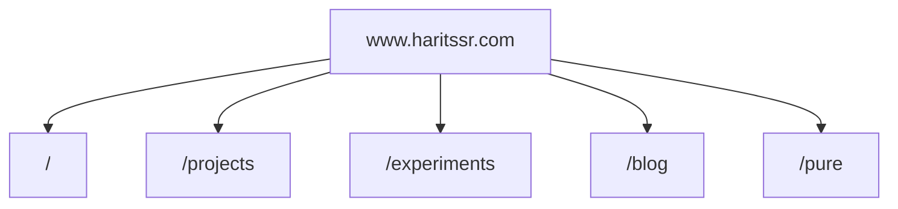

# About This Repo

This repo is Harits Syah's personal site built with Next.js (App Router).

- `projects`: Project portfolio and project detail pages.
- `experiments`: Frontend experiments across frameworks/libraries.
- `blog`: Writing and notes.
- `pure`: Design system reference.

## Site Structure

```mermaid
%%{init: {'flowchart': {'curve': 'basis'}} }%%
graph TD
  haritssr["www.haritssr.com"]
  haritssr --> home["/"]
  haritssr --> projects["/projects"]
  haritssr --> experiments["/experiments"]
  haritssr --> blog["/blog"]
  haritssr --> pure["/pure"]
```

## Tooling

- Run `bun test` to execute the tests for the `app/tools` helpers.
- Use [`utils/sqlite3.js`](utils/sqlite3.js) and [`utils/dbExperiment.js`](utils/dbExperiment.js) to inspect the shared `experiment.db` or `task.db`; they log table names and sample rows using `bun:sqlite`.

## Progressive Web App

The site is configured as an installable Progressive Web App (PWA). Installation requires HTTPS in production, plus a browser that supports web app installation.

### Added

- `app/manifest.ts` defines the app identity, scope, display mode, theme, and install icons.
- `components/ServiceWorkerRegistration.tsx` registers the service worker in production.
- `components/PWAInstallPrompt.tsx` exposes the browser's native install prompt when supported.
- `public/sw.js` caches the app shell and previously visited navigations, with the home page as an offline fallback.
- `next.config.ts` prevents stale service-worker responses by setting no-cache headers for `/sw.js`.

### Planned follow-ups

- Add Web Push notifications with VAPID keys and durable subscription storage.
- Replace the minimal navigation cache with a deliberate offline strategy for static assets and content, possibly using Serwist.
- Add automated Lighthouse or Playwright checks for manifest, installability, service-worker registration, and offline behavior.
- Add an iOS-specific installation hint because Safari does not expose `beforeinstallprompt`.

## About Author

- Name : Harits Syah
- Roles : Web Product Engineer, Web Designer, and Math-Physics Teacher.
- At : [Haris Lab](https://www.harislab.com)
- Location : [South Tangerang, Indonesia](https://www.google.com/maps/place/Kota+Tangerang+Selatan,+Banten/data=!4m2!3m1!1s0x2e69fab10419c095:0x1c880c046d198c94?sa=X&ved=2ahUKEwiCnd3VqvqAAxXzcmwGHTlLDx8Q8gF6BAgYEAA&ved=2ahUKEwiCnd3VqvqAAxXzcmwGHTlLDx8Q8gF6BAgZEAI)
- Email : [haritssr@gmail.com](mailto:haritssr@gmail.com)
- Social Media : [X](https://www.x.com/haritssr)
- Site : [www.haritssr.com](https://www.haritssr.com)

## My Core Skills

- High school and college-level math and physics
- Touch typing
- Deep understanding of the latest JavaScript, TypeScript, React.js, Next.js, Effect.ts, and browser internals along with the principles that connect them and explain why they work the way they do. (This foundation enables building modern, optimized user interfaces that align with user experience principles at scale).
- Functional Programming
  - Using it as a way to code and understanding React.js functional approach in functional component and concurrent features.
  - Using it as a way to code and understand Effect.ts structured concurrency, which enables many features through a functional approach in conjunction with the `Effect<A, E, R>` monad type.
  - In general, using it as a way to tame complexity, eliminate hidden bugs, and make code easier to test and change.
- *Currently learning to integrate authentication, databases, observability, and payments. Not yet comfortable highlighting those areas as core skills.*
