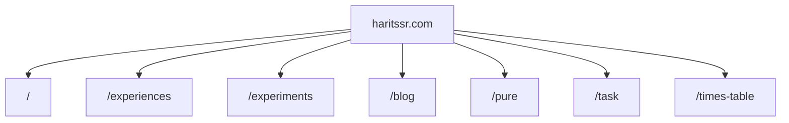

### About This Repo

This repo is Harits Syah's personal site built with Next.js (App Router).

- `experiences`: Project portfolio and project detail pages.
- `experiments`: Frontend experiments across frameworks/libraries.
- `blog`: Writing and notes.
- `pure`: Design system reference.
- `task`: Daily task manager with SQLite persistence.
- `times-table`: Math practice page.

### Site Structure

```mermaid
%%{init: {'flowchart': {'curve': 'basis'}} }%%
graph TD
  haritssr["haritssr.com"]
  haritssr --> home["/"]
  haritssr --> experiences["/experiences"]
  haritssr --> experiments["/experiments"]
  haritssr --> blog["/blog"]
  haritssr --> pure["/pure"]
  haritssr --> task["/task"]
  haritssr --> timestable["/times-table"]
```

### Site Search

- Top navigation exposes the `TopBarSearch` component (`components/TopBarSearch.tsx`), which queries the `routes.ts` token index and opens matched documentation or experiment pages in `TopBar`.
- Type a route name (e.g., `experiments/react`) and hit enter to jump straight to the matching page.

### Page That Use Database

- `app/task` stores data with `better-sqlite3` inside `TASK_DB_DIR`, which defaults to `/Users/haritssyah/developer/.data-haritssr/task.db` but can be redirected via the `TASK_DB_DIR` environment variable (read at runtime in `app/task/db.ts`).
- `app/tools` is a dedicated suite of tooling pages/tests (`app/tools/page.tsx`, `app/tools/db.ts`, `app/tools/db.core.ts`, `app/tools/db.test.js`) that operate against `/Users/haritssyah/developer/.data-haritssr/experiment.db` (shared via `sqlite3.js`/`dbExperiment.js`).

### Tooling

- Run `bun test` (added to `package.json`) to execute the tool tests targeting the new `app/tools` helpers.
- Use `sqlite3.js` and `dbExperiment.js` to inspect the shared `experiment.db` or `task.db`; they log table names and sample rows using `bun:sqlite`.

### About Author

- Name : Harits Syah
- Roles : Web Product Engineer, Web Designer, and Math-Physics Teacher.
- At : [Haris Lab](https://www.harislab.com)
- Location : [South Tangerang, Indonesia](https://www.google.com/maps/place/Kota+Tangerang+Selatan,+Banten/data=!4m2!3m1!1s0x2e69fab10419c095:0x1c880c046d198c94?sa=X&ved=2ahUKEwiCnd3VqvqAAxXzcmwGHTlLDx8Q8gF6BAgYEAA&ved=2ahUKEwiCnd3VqvqAAxXzcmwGHTlLDx8Q8gF6BAgZEAI)
- Email : [haritssr@gmail.com](mailto:haritssr@gmail.com)
- Social Media : [X](https://www.x.com/haritssr)
- Site : [haritssr.com](https://www.haritssr.com)
