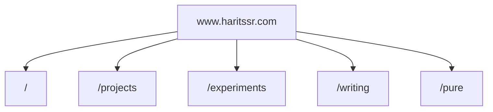

# About This Repo

This repo is Harits Syah's personal site built with Next.js (App Router).

- [`projects`](/projects): Project portfolio and project detail pages.
- [`experiments`](/experiments): Frontend experiments across frameworks and libraries.
- [`writing`](/writing): Writing and notes.
- [`pure`](/pure): Design system reference.

## Site Structure

```mermaid
%%{init: {'flowchart': {'curve': 'basis'}} }%%
graph TD
  haritssr["www.haritssr.com"]
  haritssr --> home["/"]
  haritssr --> projects["/projects"]
  haritssr --> experiments["/experiments"]
  haritssr --> writing["/writing"]
  haritssr --> pure["/pure"]
```

## RSS Feed

The writing RSS feed is available at [`/feed.xml`](https://www.haritssr.com/feed.xml).
Visitors can paste this URL into an RSS reader such as Feedly, Inoreader,
NetNewsWire, or Thunderbird. The Writing page also includes a **Subscribe via
RSS** link.

The feed is generated from the writing content collection:

1. Writing is added to `data/writing/*.mdx` with a `publishedAt` value in
   `YYYY-MM-DD` format.
2. Content Collections validates and loads the writing as `allWritings`.
3. `app/feed.xml/route.ts` passes the collection to `utils/rss.ts`.
4. The renderer creates a static RSS 2.0 document with each writing's title,
   summary, canonical URL, publication date, and topic.

The feed contains summaries that link to the full writings. In development,
Content Collections watches for changes and updates the feed. In production,
the feed is regenerated during deployment, so a new deployment is required
for a new writing to appear in the live feed.

## Architecture Decision Records

Architecture Decision Records (ADRs) document the important decisions that
shape this site’s structure, dependencies, and long-term maintenance. Each ADR
captures one decision, its context, the alternatives considered, its
consequences, confidence, and the conditions that should trigger a review.

ADRs are stored as short, numbered Markdown files in [`data/adr`](data/adr).
Accepted records are historical and should not be rewritten. When a decision
changes, create a new ADR and link it as the superseding decision.

See the [ADR index](data/adr/README.md) for the current decisions, including
the Next.js App Router, Content Collections, Effect, Biome/Ultracite, and the
installable PWA architecture.

## Tooling

- Run `bun test` to execute the tests for the `app/tools` helpers.
- Use [`utils/sqlite3.js`](utils/sqlite3.js) and
  [`utils/dbExperiment.js`](utils/dbExperiment.js) to inspect the shared
  `experiment.db` or `task.db`. They log table names and sample rows using
  `bun:sqlite`.

## Progressive Web App

The site is configured as an installable Progressive Web App (PWA).
Installation requires HTTPS in production, plus a browser that supports web
app installation. See [ADR 0005](data/adr/0005-support-installable-pwa.md) for
the architectural rationale.

### Current implementation

- `app/manifest.ts` defines the app identity, scope, display mode, theme, and
  install icons.
- `components/ServiceWorkerRegistration.tsx` registers the service worker in
  production.
- `components/PWAInstallPrompt.tsx` exposes the browser's native install prompt
  when supported.
- `public/sw.js` caches the app shell and previously visited navigations, with
  the home page as an offline fallback.
- `next.config.ts` prevents stale service-worker responses by setting no-cache
  headers for `/sw.js`.

### Planned follow-ups

- Add Web Push notifications with VAPID keys and durable subscription storage.
- Replace the minimal navigation cache with a deliberate offline strategy for
  static assets and content, possibly using Serwist.
- Add automated Lighthouse or Playwright checks for manifest, installability,
  service-worker registration, and offline behavior.
- Add an iOS-specific installation hint because Safari does not expose
  `beforeinstallprompt`.

## Author

[www.haritssr.com](https://www.haritssr.com)

## My Core Skills

- High school and college-level math and physics
- Touch typing
- Deep understanding of the latest JavaScript, TypeScript, React.js, Next.js,
  Effect.ts, and browser internals along with the principles that connect them
  and explain why they work the way they do. This foundation enables building
  modern, optimized user interfaces that align with user experience principles
  at scale.
- Functional Programming
  - Using it as a way to code and understanding React.js functional approach in functional component and concurrent features.
  - Using it as a way to code and understand Effect.ts structured concurrency, which enables many features through a functional approach in conjunction with the `Effect<A, E, R>` monad type.
  - In general, using it as a way to tame complexity, eliminate hidden bugs, and make code easier to test and change.
- Currently learning to integrate authentication, databases, observability,
  and payments. Not yet comfortable highlighting those areas as core skills.
