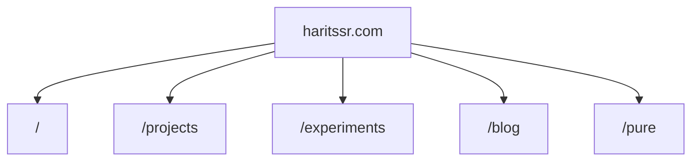

### About This Repo

This repo is Harits Syah's personal site built with Next.js (App Router).

- `projects`: Project portfolio and project detail pages.
- `experiments`: Frontend experiments across frameworks/libraries.
- `blog`: Writing and notes.
- `pure`: Design system reference.

### Site Structure

```mermaid
%%{init: {'flowchart': {'curve': 'basis'}} }%%
graph TD
  haritssr["haritssr.com"]
  haritssr --> home["/"]
  haritssr --> projects["/projects"]
  haritssr --> experiments["/experiments"]
  haritssr --> blog["/blog"]
  haritssr --> pure["/pure"]
```

### Tooling

- Run `bun test` (added to `package.json`) to execute the tool tests targeting the new `app/tools` helpers.
- Use `sqlite3.js` and `dbExperiment.js` to inspect the shared `experiment.db` or `task.db`; they log table names and sample rows using `bun:sqlite`.

### About Author

- Name : Harits Syah
- Roles : Web Product Engineer, Web Designer, and Math-Physics Teacher.
- At : [Haris Lab](https://www.harislab.com)
- Location : [South Tangerang, Indonesia](https://www.google.com/maps/place/Kota+Tangerang+Selatan,+Banten/data=!4m2!3m1!1s0x2e69fab10419c095:0x1c880c046d198c94?sa=X&ved=2ahUKEwiCnd3VqvqAAxXzcmwGHTlLDx8Q8gF6BAgYEAA&ved=2ahUKEwiCnd3VqvqAAxXzcmwGHTlLDx8Q8gF6BAgZEAI)
- Email : [haritssr@gmail.com](mailto:haritssr@gmail.com)
- Social Media : [X](https://www.x.com/haritssr)
- Site : [haritssr.com](https://www.haritssr.com)

## My Core Skills

- Highschool and college level Math-Physics
- Touch typing
- Deep understanding of the latest JavaScript, TypeScript, React.js, Next.js, Effect.ts, and browser internals along with the principles that connect them and explain why they work the way they do. (This foundation enables building modern, optimized user interfaces that align with user experience principles at scale).
- Functional Programming
  - Using it as a way to code and understanding React.js functional approach in functional component and concurrent features.
  - Using it as a way to code and understanding Effect.ts structured concurrency that enable so many features with functional approach in conjuction with Effect<A,E,R> monad type.
  - In general, using it as a way to tame complexity, eliminate hidden bug, and make code easier to test and change.
- *Currently learning to integrate authentication, databases, observability, and payments. Not yet comfortable highlighting those area as a core skill.*
