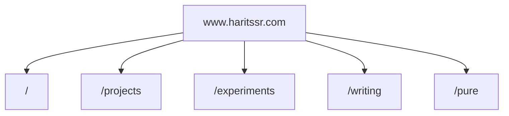

# About This Repo

This repo is Harits Syah's personal site built with Next.js (App Router).

- [`projects`](/projects): Project portfolio and project detail pages.
- [`experiments`](/experiments): Frontend experiments across frameworks and libraries.
- [`writing`](/writing): Writing and notes.
- [`pure`](/pure): Design system reference.

## Site Structure

```mermaid
%%{init: {'flowchart': {'curve': 'basis'}} }%%
graph TD
  haritssr["www.haritssr.com"]
  haritssr --> home["/"]
  haritssr --> projects["/projects"]
  haritssr --> experiments["/experiments"]
  haritssr --> writing["/writing"]
  haritssr --> pure["/pure"]
```

## Documentation

- [RSS feed](docs/rss.md): feed usage and generation details.
- [Progressive Web App](docs/pwa.md): installability and service-worker details.
- [Architecture Decision Records](docs/adr/README.md): decisions that shape the site.

## Tooling

- Run `bun test` to execute the tests for the `app/experiments/ui-explorations/tools` helpers.
- Use [`utils/sqlite3.js`](utils/sqlite3.js) and
  [`utils/dbExperiment.js`](utils/dbExperiment.js) to inspect the shared
  `experiment.db` or `task.db`. They log table names and sample rows using
  `bun:sqlite`.

## Author

[www.haritssr.com](https://www.haritssr.com)

## My Core Skills

- High school and college-level math and physics
- Touch typing
- Deep understanding of the latest JavaScript, TypeScript, React.js, Next.js,
  Effect.ts, and browser internals along with the principles that connect them
  and explain why they work the way they do. This foundation enables building
  modern, optimized user interfaces that align with user experience principles
  at scale.
- Functional Programming
  - Using it as a way to code and understanding React.js functional approach in functional component and concurrent features.
  - Using it as a way to code and understand Effect.ts structured concurrency, which enables many features through a functional approach in conjunction with the `Effect<A, E, R>` monad type.
  - In general, using it as a way to tame complexity, eliminate hidden bugs, and make code easier to test and change.
- Currently learning to integrate authentication, databases, observability,
  and payments. Not yet comfortable highlighting those areas as core skills.
